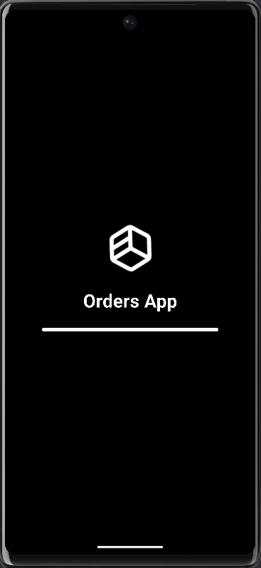
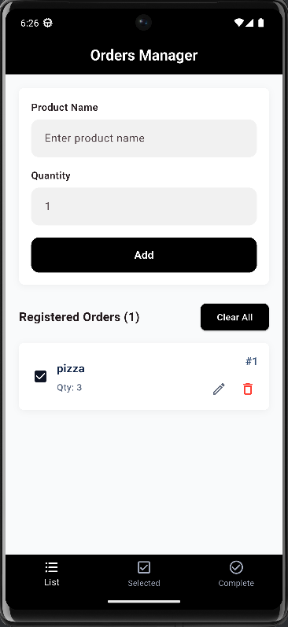
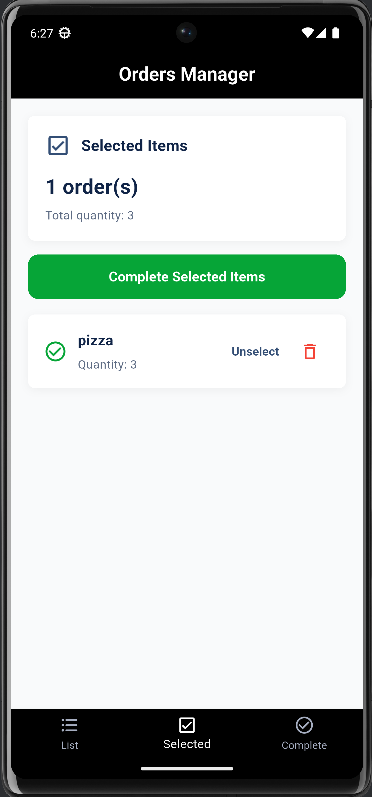
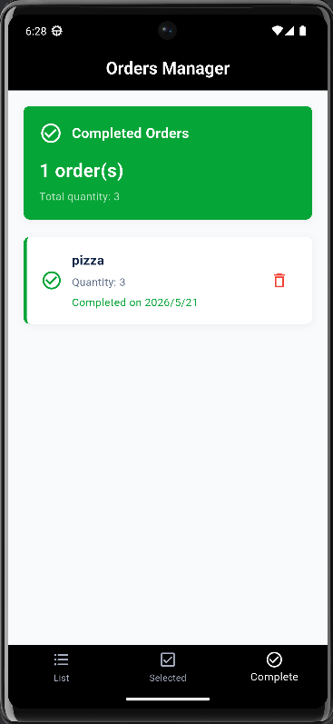

# Orders Manager

Orders Manager is a Flutter mobile application for managing simple product orders. The app allows the user to add orders, select the orders that are ready to be completed, and keep completed orders in a separate screen.

This project was built for the Git and GitHub field training assignment. I used it to practice working with Git commands, multiple commits, branches, issues, pull requests, and a clean project structure.

Repository link:

```text
https://github.com/Abdallah-Abu-Shawish/github-training-project
```

## Project Idea

The idea of the app is simple: instead of keeping orders written randomly, the user can enter the product name and quantity, then manage the order through three main sections:

- active orders
- selected orders
- completed orders

The project is small, but it follows a clear structure so the code is easier to read and improve.

## Main Features

- Add new product orders
- Validate product name and quantity before saving
- Display all active orders
- Select and unselect orders
- Complete selected orders
- Display completed orders separately
- Show total quantities for selected and completed orders
- Delete orders with a confirmation dialog
- Show empty states when there is no data
- Handle loading errors with a retry option
- Use a separate branch for a bottom navigation design update

## Screenshots

Place the project screenshots inside a folder named `screenshots`.

Recommended screenshot names:

```text
screenshots/
  splash_screen.png
  orders_list.png
  selected_orders.png
  completed_orders.png
```

After adding the screenshots, this section can display them like this:

### Splash Screen



### Orders List



### Selected Orders



### Completed Orders



## Technologies Used

- Flutter
- Dart
- GetX
- sqflite
- Git
- GitHub

## Project Structure

```text
lib/
  controllers/
    order_controller.dart
  database/
    db_helper.dart
  models/
    order_model.dart
  views/
    complete_screen.dart
    home_screen.dart
    list_screen.dart
    selected_screen.dart
    splash_screen.dart
    widgets/
      app_card.dart
      confirm_action_dialog.dart
      custom_text_field.dart
      empty_state_widget.dart
      order_form_dialog.dart
      order_list_card.dart
      primary_button.dart
      section_header.dart
      selected_order_card.dart
      summary_card.dart
```

## Code Organization

The project is organized into small folders with clear responsibilities:

- `controllers`: contains order state and order actions
- `database`: contains the SQLite database helper
- `models`: contains the order data model
- `views`: contains the main app screens
- `views/widgets`: contains reusable UI widgets used by the screens
- `images`: contains app image assets

This structure keeps the screen files cleaner and makes the order logic easier to maintain.

## Git Workflow

The project was developed using Git from the local machine. The main work was done on the `master` branch, and a separate feature branch was created for the design update.

Feature branch:

```text
feature/design-update
```

The feature branch was used for the BottomNavigationBar design improvement. This branch is intended to be reviewed and merged through a Pull Request on GitHub.

## Important Git Commands Used

```bash
git init
git add .
git commit -m "first commit"
git status
git log --graph
git branch
git checkout -b feature/design-update
git checkout master
git merge feature/design-update
git remote add origin https://github.com/Abdallah-Abu-Shawish/github-training-project.git
git push origin master
git push origin feature/design-update
```

## How to Run the Project

1. Clone the repository:

```bash
git clone https://github.com/Abdallah-Abu-Shawish/github-training-project.git
```

2. Open the project folder:

```bash
cd github-training-project
```

3. Install dependencies:

```bash
flutter pub get
```

4. Run the project:

```bash
flutter run
```

## Assignment Checklist

- Repository created on GitHub
- Repository is public
- Flutter project added to the repository
- `.gitignore` included
- More than five commits added
- Feature branch created
- Branch design update added
- Branch merged with `master`
- README updated
- Issue created on GitHub
- Pull Request created on GitHub
- Project screenshots prepared
- PDF report prepared for submission

## Student

Abdallah Abu Shawish
